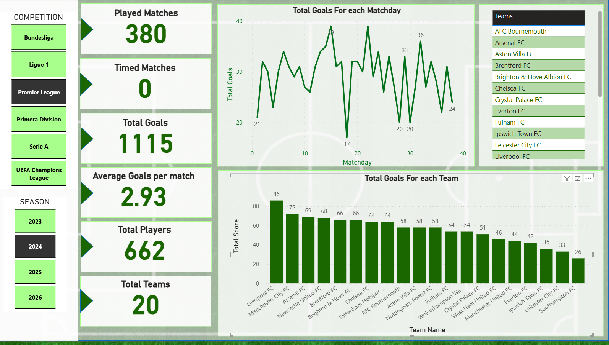
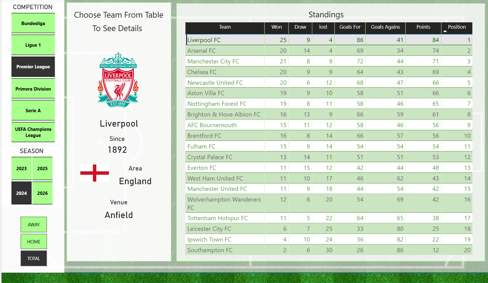
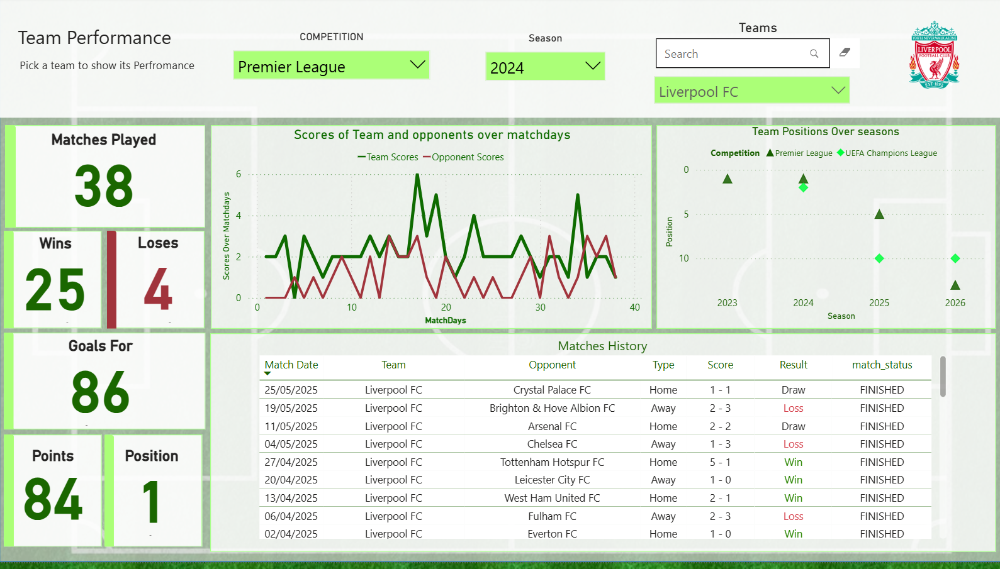
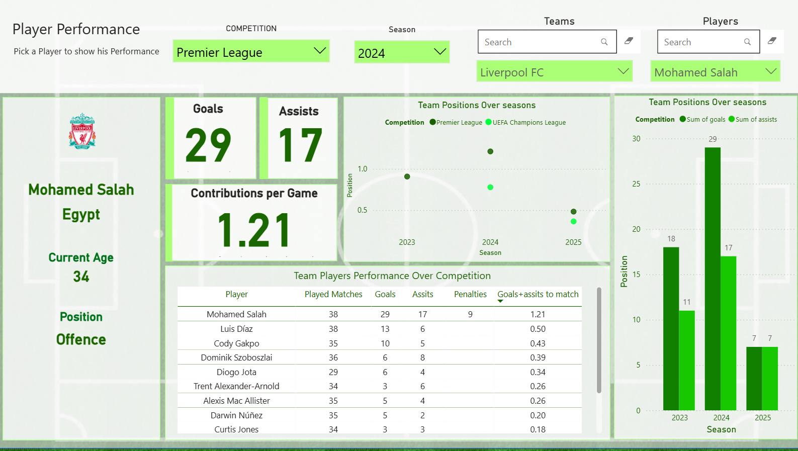
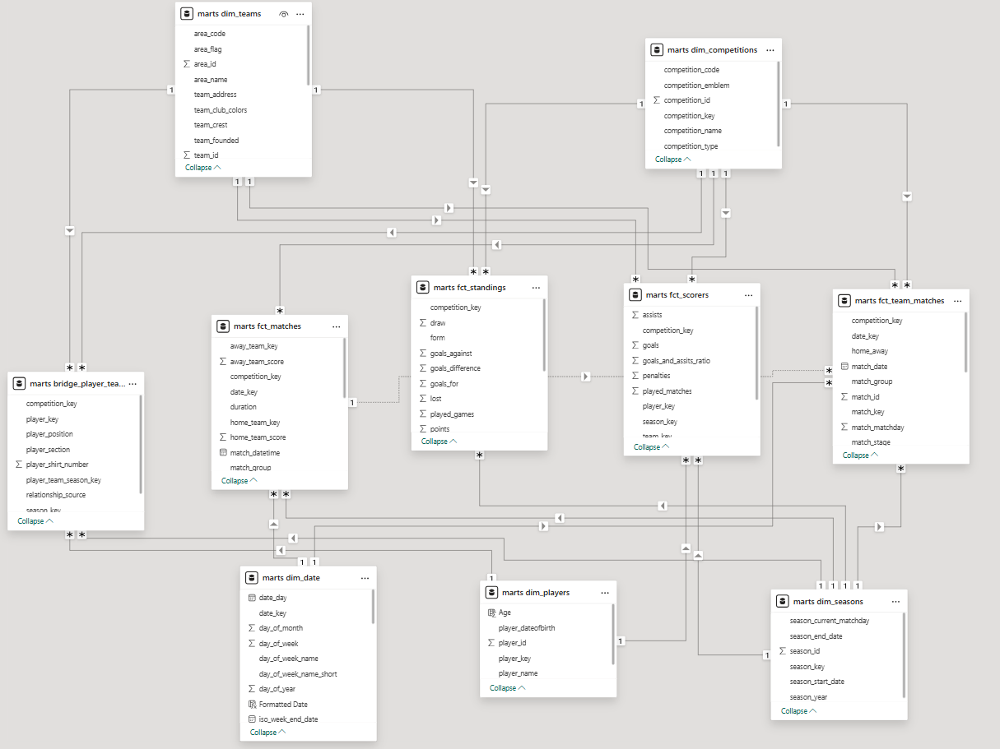

# Football Data Engineering Project

An end-to-end football analytics platform that extracts competition data from the Football Data API, stores the latest raw responses in MinIO, loads JSONB staging tables in PostgreSQL, transforms the data with dbt, and exposes dimensional marts for Power BI.

## Project Diagram


## Overview

This project is an ELT pipeline for football competitions and seasons. The extraction configuration currently includes six competitions:

| Competition code | Competition           |
| ---------------- | --------------------- |
| `PL`             | Premier League        |
| `SA`             | Serie A               |
| `BL1`            | Bundesliga            |
| `FL1`            | Ligue 1               |
| `PD`             | La Liga               |
| `CL`             | UEFA Champions League |

For each competition and season, the pipeline requests four resources:

- standings
- matches
- scorers
- teams

The raw API payload is written to MinIO before it is loaded into PostgreSQL. Version 1 keeps the latest response for each competition, season, and resource key; it does not retain historical API snapshots. dbt then converts the semi-structured JSONB staging data into relational intermediate models and dimensional marts suitable for analysis in Power BI.

## Tools Used

| Tool                                                                                                            | Role in the project                                                         |
| --------------------------------------------------------------------------------------------------------------- | --------------------------------------------------------------------------- |
|       | Orchestrates API extraction, staging load, retries, and the dbt build task. |
|                                | Implements API extraction and data-loading tasks.                           |
|  | Supplies competition, match, team, standings, and scorer data.              |
|                                   | Provides S3-compatible object storage for the bronze layer.                 |
|                    | Stores JSONB staging data and the transformed warehouse.                    |
|                                         | Builds models, applies warehouse transformations, and runs data tests.      |
|                                | Runs the local PostgreSQL and MinIO services.                               |
|                        | Visualizes the final facts and dimensions.                                  |

## Architecture

### 1. Extract

The main DAG in [`dags/elt_football_v1.py`](dags/elt_football_v1.py) creates mapped extraction tasks for the configured competitions and four API resources: standings, matches, scorers, and teams. The task uses the DAG logical date as the requested season. The `dags/config/config.yaml` file currently lists historical seasons for future multi-season mapping, but those values are not yet passed into task mapping.

The extractor also:

- sends the API token through the `X-Auth-Token` header;
- classifies authentication, client, rate-limit, server, and unexpected responses;
- retries rate-limit, server, timeout, and connection failures through Airflow;
- limits API concurrency through the Airflow `api_pool`;
- writes each response to a predictable object-storage key;
- records metadata such as competition, season, resource, bucket, and object key.

### 2. Load

The `staging_loader` task reads each JSON object from MinIO and inserts it into the matching PostgreSQL table:

```text
staging.standings_raw
staging.matches_raw
staging.scorers_raw
staging.teams_raw
```

Each row contains the source file, ingestion timestamp, and complete API response in a PostgreSQL `JSONB` column. The source file is used as the conflict key so a rerun updates the same source record instead of blindly duplicating it.

### 3. Transform

The dbt project is located in [`dbt/football`](dbt/football). Its models are organized into two layers:

| Layer        | Materialization                     | Purpose                                                            |
| ------------ | ----------------------------------- | ------------------------------------------------------------------ |
| Intermediate | Tables in the `intermediate` schema | Parse JSONB, standardize fields, and prepare reusable entities.    |
| Marts        | Tables in the `marts` schema        | Present dimensions, bridge relationships, and facts for analytics. |

The main dbt models include:

- intermediate entities: competitions, matches, players, referees, scorers, seasons, standings, and teams;
- dimensions: competitions, dates, players, seasons, and teams;
- bridge table: player-team-season relationships;
- facts: matches, scorers, and standings.

The date dimension uses the [`dbt_date`](dbt/football/dbt_packages/dbt_date) package, while [`dbt_utils`](dbt/football/dbt_packages/dbt_utils) provides reusable data tests. The staging contract is documented in [`docs/staging_contracts.md`](docs/staging_contracts.md), and the API response policy is documented in [`docs/api_failure_policy.md`](docs/api_failure_policy.md).

## Warehouse Model

The marts layer follows a dimensional design:

| Model                       | Type      | Analytical purpose                                                                        |
| --------------------------- | --------- | ----------------------------------------------------------------------------------------- |
| `dim_competitions`          | Dimension | Competition identity and descriptive attributes.                                          |
| `dim_date`                  | Dimension | Calendar attributes for match-date analysis.                                              |
| `dim_players`               | Dimension | One record per player.                                                                    |
| `dim_seasons`               | Dimension | Season identity and season year.                                                          |
| `dim_teams`                 | Dimension | One record per team.                                                                      |
| `bridge_player_team_season` | Bridge    | Resolves the many-to-many relationship between players, teams, seasons, and competitions. |
| `fct_matches`               | Fact      | Match results, scores, teams, competitions, seasons, and dates.                           |
| `fct_scorers`               | Fact      | Player appearances, goals, assists, penalties, and scoring ratios.                        |
| `fct_standings`             | Fact      | Position, games played, wins, draws, losses, points, and goal statistics.                 |

## Intelligent Engineering Decisions

These are the decisions that make the project more reliable and more useful than a simple API-to-table script:

| Decision                                      | Why it matters                                                                                                                              |
| --------------------------------------------- | ------------------------------------------------------------------------------------------------------------------------------------------- |
| Bronze object storage before database loading | Separates extraction failures from transformation failures and keeps the latest source response outside the warehouse.                      |
| Dynamic task mapping                          | Generates extraction tasks from the competition, resource, and season lists instead of duplicating task definitions by hand.                |
| Explicit API failure policy                   | Distinguishes failures that should stop immediately from failures that should be retried by Airflow.                                        |
| Airflow retry and backoff policy              | Retries transient rate-limit, server, timeout, and connection failures without retrying authentication or invalid-request failures.         |
| Airflow pool for API calls                    | Controls concurrency and protects the upstream service from a burst of requests.                                                            |
| JSONB staging                                 | Retains nested source data while allowing PostgreSQL to store and query the raw payload efficiently.                                        |
| Upsert by source file                         | Makes repeated runs idempotent for an already extracted competition, season, and resource.                                                  |
| Intermediate and mart layers                  | Keeps parsing logic separate from the business-facing dimensional model.                                                                    |
| Bridge table for player relationships         | Represents players who can be associated with different teams across seasons and competitions without duplicating player dimension records. |
| dbt schema and data tests                     | Checks keys, nullability, accepted match results, score validity, relationship uniqueness, and calculated football statistics.              |
| Separate local services                       | Keeps object storage and relational storage independently restartable and easier to inspect during development.                             |

## What I Learned

The following topics are recorded in [`Learned.md`](Learned.md) because they were new or particularly important during this project:

| Topic                            | How it appears in this project                                                                                                 |
| -------------------------------- | ------------------------------------------------------------------------------------------------------------------------------ |
| Airflow dynamic task mapping     | `get_data.expand(...)` and `staging_loader.expand(...)` create tasks for many API inputs at runtime.                           |
| Airflow hooks                    | `S3Hook` and `PostgresHook` manage connections through Airflow instead of embedding connection logic in each task.             |
| Multiple PostgreSQL containers   | The local setup separates the application database service from other possible PostgreSQL environments and connection targets. |
| PostgreSQL JSONB                 | API responses are loaded as JSONB in the staging layer before being normalized by dbt.                                         |
| Scorer and player reconciliation | Scorer responses can contain player information that needs to be reconciled with the player reference data.                    |
| Bridge tables in a warehouse     | `bridge_player_team_season` models player membership across teams, seasons, and competitions.                                  |
| Airflow pools                    | The API pool provides a practical concurrency control for rate-limited extraction.                                             |

## Data Quality Checks

The dbt tests in [`dbt/football/tests/intermediate.yml`](dbt/football/tests/intermediate.yml) and [`dbt/football/tests/marts.yml`](dbt/football/tests/marts.yml) cover:

- non-null and unique business keys;
- valid match results: `HOME_TEAM`, `AWAY_TEAM`, and `DRAW`;
- unique player-team-season-competition combinations;
- non-negative scores, goals, assists, penalties, and standings metrics;
- standings goal difference matching `goals_for - goals_against`;
- valid calculated scorer ratios.

Run the dbt build from the dbt project directory:

```powershell
cd dbt/football
dbt build --profiles-dir profiles --project-dir .
```

## Local Setup

### Prerequisites

- Docker Desktop
- Astro CLI or an equivalent Airflow runtime
- Python with the packages in [`requirements.txt`](requirements.txt)
- A Football Data API token
- Power BI Desktop, if you want to build the dashboard

### Start the local services

The project starts PostgreSQL and MinIO with [`docker-compose.override.yml`](docker-compose.override.yml). PostgreSQL runs the initialization script at [`docker/postgres/init/01_create_staging.sql`](docker/postgres/init/01_create_staging.sql) when the database volume is created:

```powershell
docker compose up -d
```

For a clean local bootstrap, where existing local database data can be discarded:

```powershell
docker compose down -v
docker compose up -d
```

The local service endpoints are:

| Service       | Address          | Purpose                                               |
| ------------- | ---------------- | ----------------------------------------------------- |
| PostgreSQL    | `localhost:5434` | Warehouse database `football_dwh`.                    |
| MinIO API     | `localhost:9000` | S3-compatible object storage endpoint.                |
| MinIO console | `localhost:9001` | Browser interface for inspecting buckets and objects. |

The compose file initializes a `bronze` bucket and uses `minioadmin` as the local development credential. Do not reuse these credentials outside local development.

### Configure Airflow

Configure the following Airflow connections and values in the local Airflow environment:

| ID or variable | Expected value                                                                                |
| -------------- | --------------------------------------------------------------------------------------------- |
| `minio_conn`   | S3-compatible connection pointing to MinIO at `http://minio:9000` inside the Airflow network. |
| `app_db_conn`  | PostgreSQL connection for `football_dwh`.                                                     |
| `X-Auth-Token` | The Football Data API token exposed as an environment variable.                               |
| `api_pool`     | An Airflow pool used by the mapped API extraction tasks.                                      |

The local connection, pool, and variable template is [`airflow_settings.yaml`](airflow_settings.yaml). Keep tokens and passwords out of source control.

### Run the pipeline

1. Start the local services and Airflow environment.
2. Confirm the `minio_conn` and `app_db_conn` connections exist.
3. Create or confirm the `api_pool` pool.
4. Set the `X-Auth-Token` environment variable.
5. Trigger the `elt_football_v1` DAG.
6. Inspect raw objects in MinIO, staging rows in PostgreSQL, and marts after the dbt task completes.

The older [`dags/elt_football.py`](dags/elt_football.py) DAG is retained as an earlier extraction approach. [`dags/elt_football_v1.py`](dags/elt_football_v1.py) is the more complete version because it includes staging and dbt transformation tasks.

## Power BI Dashboard

The Power BI report is available at [`Dashboards/Football-dashboard.pbix`](Dashboards/Football-dashboard.pbix). It is connected to the dimensional marts produced by dbt and supports analysis of competitions, seasons, teams, matches, standings, and player performance.

The dashboard can answer questions such as:

- Which teams lead a competition in points and goal difference?
- How do home and away results compare?
- Which players have the strongest goal and assist output?
- How do team and player performance change between seasons?
- Which players are associated with multiple teams across the available seasons?

### Dashboard Screenshots

#### Dashboard Overview



The overview page summarizes played matches, goals, average goals per match, players, teams, goals by matchday, and goals by team.

#### Competition Standings



The standings page provides team-level wins, draws, losses, goals, points, position, and selected team details.

#### Team Performance



The team page compares results, scores, positions across seasons, and match history for a selected team.

#### Player Performance



The player page presents goals, assists, contribution per match, competition history, and squad performance.

### Power BI Data Model



The model uses shared dimensions for competitions, dates, players, seasons, and teams. Fact tables contain matches, standings, scorers, and team-match analysis, while `bridge_player_team_season` represents player membership across teams, seasons, and competitions.

## Repository Structure

```text
.
|-- dags/                       # Airflow DAGs
|-- include/staging/            # Earlier standalone staging utilities
|-- dbt/football/
|   |-- models/intermediate/     # Parsed and standardized models
|   |-- models/marts/            # Dimensions, bridge, and fact tables
|   |-- tests/                  # dbt schema and data tests
|   `-- profiles/               # Local dbt profile configuration
|-- Dashboards/                 # Power BI report and dashboard screenshots
|-- minio_test/                 # Example API payloads
|-- docker-compose.override.yml # Local PostgreSQL and MinIO services
|-- Dockerfile                  # Airflow runtime image
|-- requirements.txt            # Python and dbt dependencies
`-- Learned.md                  # Topics learned during development
```

## Current Limitations and Next Improvements

- Pass configured seasons into the mapped extraction tasks so historical seasons are loaded deliberately rather than deriving one season from the DAG logical date.
- Add incremental loading and a formal extraction audit table.
- Move API credentials and local connection values into a secrets manager for deployed environments.
- Add freshness and source-volume tests to the dbt project.
- Add automated tests for API rate-limit and retry behavior.
- Add relationship tests and explicit uniqueness tests for every fact-table grain.
- Add a documented Power BI data-source configuration.
